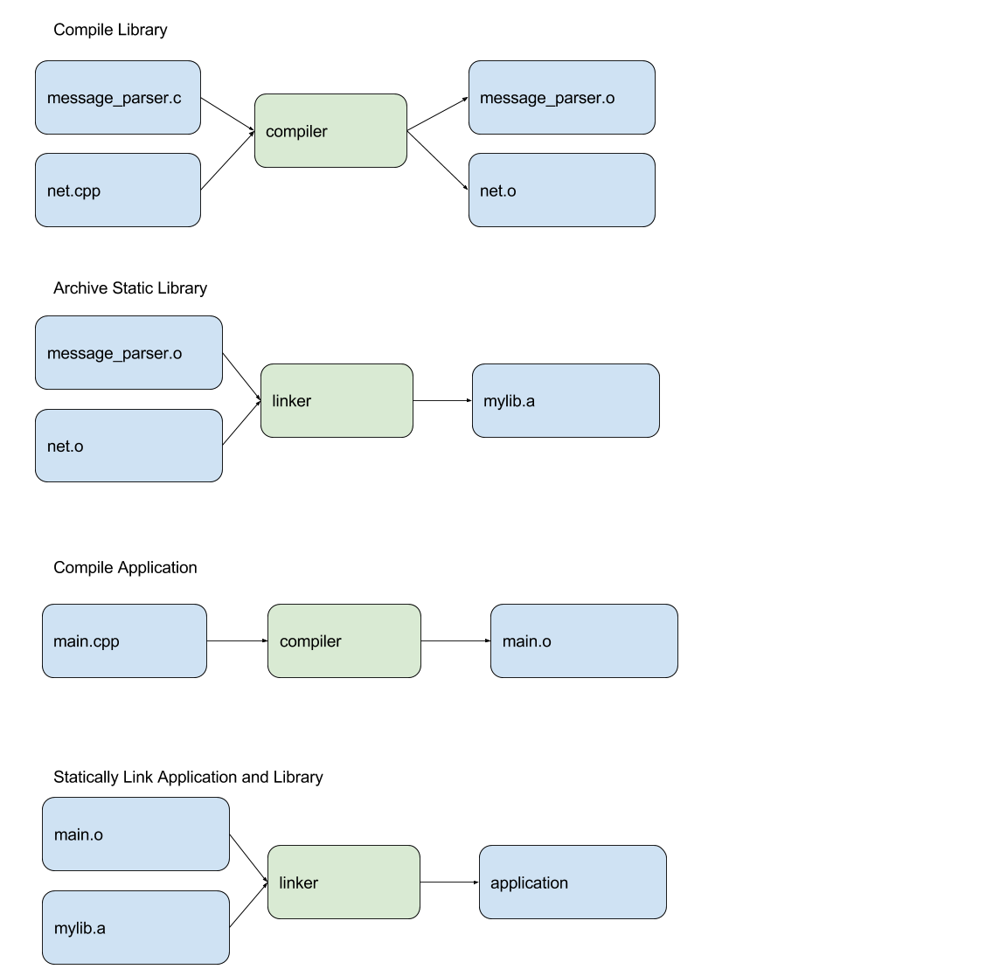
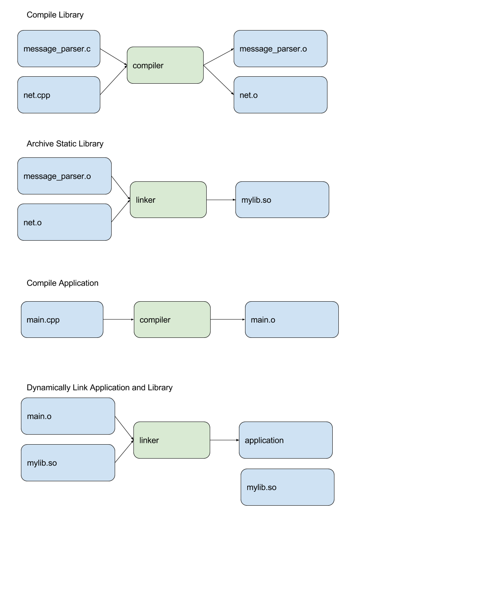

# Environment Setup Ubuntu 17.04
```bash
sudo apt-get remove libopencv-dev
sudo apt-get install build-essential cmake qtcreator
pushd /tmp
git clone https://github.com/opencv/opencv.git
cd opencv
mkdir build
cd build
cmake ..
make -j8
sudo make install
```

# Environment Setup OSX
```bash
1. brew update && brew upgrade
2. brew install cmake opencv
3. Download and install Qt Creator https://download.qt.io/official_releases/qtcreator/4.3/4.3.1/qt-creator-opensource-mac-x86_64-4.3.1.dmg
```

# Build it
```bash
mkdir build
cd build
cmake .. -DCMAKE_BUILD_TYPE=DEBUG
make VERBOSE=1
./opencv
```

# Debug on Linux
```bash
gdb ./opencv
```

# Debug on OSX
```bash
lldb ./opencv
```

# QtCreator
1. Open QtCreator
2. File-> Open CMakeLists.txt
3. Choose toolkit
4. Set target to Debug (Left-hand panel icons)
5. Build
6. Set Breakpoints in main.cpp
7. Run Debugger

# Linker
## Static


## Dynamic



# References
* [Qt Creator|https://www.qt.io/ide/]

